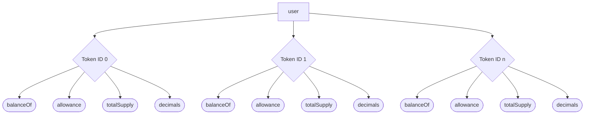

# The "Pretty Obvious If You Think About It" Multi-Token EIP

## Token ID Visualization

## Links

- [EIP Draft](https://github.com/ethereum/EIPs/pull/6909)
- [EIP Discussion](https://ethereum-magicians.org/t/eip-6909-multi-token-standard/13891)

## Reference Implementations

| Language | Implementation                                          | Status                   |
| -------- | ------------------------------------------------------- | ------------------------ |
| Solidity | [ERC6909](src/ERC6909.sol)                              | complete                 |
| Solidity | [ERC6909Metadata](src/ERC6909Metadata.sol)              | complete                 |
| Solidity | [IERC6909](src/interfaces/IERC6909.sol)                 | complete                 |
| Solidity | [IERC6909Metadata](src/interfaces/IERC6909Metadata.sol) | complete                 |
| Vyper    | [ERC6909](alt/ERC6909.vy)                               | ready for testing        |
| Fe       | [ERC6909](alt/ERC6909.fe)                               | in development (blocked) |
